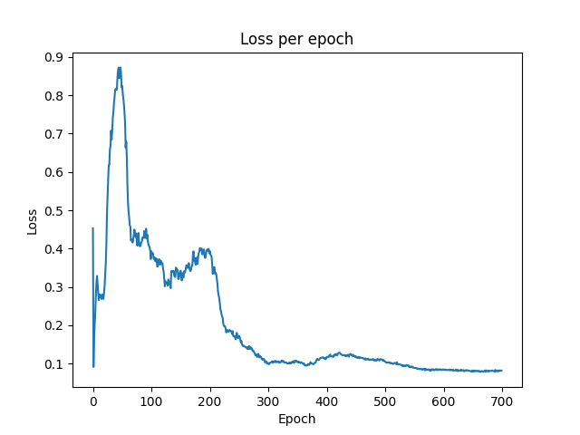

# Shelfhelp Models
### This repository contains the training script for some of the models to improve CV performance in the project [Shelfhelp](https://shivendraagrawal.github.io/projects/shelfhelp/). This uses [pytorch lightning](https://www.pytorchlightning.ai/index.html) and [pytorch lightning bolts](https://github.com/Lightning-Universe/lightning-boltshttps://www.pytorchlightning.ai/bolts). 

## Background:
- The work is part of my independent study for the Spring 2023 semester. I worked with Shivendra Agrawal currently working towards designing a smartcane for the visually impaired and blind which would help them in grocery shopping. The smartcane comprises of a dual Realsense (T265 + D455) setup. 
- I initially started off by reading papers related to SLAM and occupancy grid; specifically for indoor use cases and for localizing blind people. I also read a paper that suggested using directional sound as a feedback for communicating with blind people. 
- I then proceeded to read blogs for siamese-like networks that would be helpful in distinguishing between products. The current system uses the encoder part of an autoencoder to extract features and compare them. There is a possible scope for improvement here - using more sophisticated models that are specifically designed to distinguish between two images. 
- I tried training two models - SimCLR and BYOL for learning representations of product images. I also trained a classifier on the freiburg dataset to classify different classes of products in a grocery store.

## Literature:
- Blogs:
  - https://towardsdatascience.com/a-friendly-introduction-to-siamese-networks-85ab17522942
  - https://sh-tsang.medium.com/review-byol-bootstrap-your-own-latent-a-new-approach-to-self-supervised-learning-6f770a624441
- Videos:
  - https://www.youtube.com/watch?v=a7-qwwAFs_s&pp=ygUGc2ltY2xy
  - https://www.youtube.com/watch?v=wySLC4nszv8&pp=ygUGc2ltY2xy
  - https://www.youtube.com/watch?v=APki8LmdJwY&pp=ygUGc2ltY2xy
  - https://www.youtube.com/watch?v=_1eKr4rbgRI&pp=ygUQc2ltY2xyIGxpZ2h0bmluZw%3D%3D
- Papers:
  - https://arxiv.org/pdf/2212.04745.pdf
  - https://www.mdpi.com/2076-3417/12/1/523
  - https://ieeexplore.ieee.org/document/9022544
  - https://arxiv.org/abs/1704.03489
  - https://april.eecs.umich.edu/pdfs/goeddel2016iros_a.pdf
  - https://dl.acm.org/doi/fullHtml/10.1145/3547522.3547685
  - https://arxiv.org/pdf/2001.03676.pdf
  - https://ieeexplore.ieee.org/document/9937109/

I have included the summaries/key takeaways of some of the papers I read to [SUMMARY.md](SUMMARY.md)

## Introduction:
#### It is impossible to train an object classifier to identify the sheer number products that are found in a grocery store. Shelfhelp uses a model that converts product images in the scene to feature vectors and then compares it with the feature vector of the user-provided image to find the closest match. The model used for this approach is the encoder part of an autoencoder which leverages training data to learn relevant image features.
#### "[Siamese networks](https://towardsdatascience.com/a-friendly-introduction-to-siamese-networks-85ab17522942)" are a class of networks that are well-suited for this use case. This repo (mostly) contains the training scripts for this class of networks. 

## Models:
1. [SimCLR](https://arxiv.org/pdf/2002.05709.pdf) is a framework for self-supervised training of models to learn visual representations. Some key takeaways from the paper:
   - The authors identified a set of augmentations that result in good performance of the model. 
   - They identified that an additional projection head *g(.)* before defining contrastive loss improves the representation of the previous layer. For instance, say *h* and *h\'* are the two representation vectors, applying contrastive loss between *g(h)* and *g(h\')* improves representation quality of *h* and *h\'* than applying contrastive loss directly on *h* and *h\'*.
   - They found normalized cross-entropy works best when compared to other contrastive loss functions.

2. [BYOL](https://arxiv.org/pdf/2006.07733.pdf) uses a target and an online network both with very similar architectures. The weights of the target network are a moving average of the online network. The major contribution of this paper was that the authors achieved good performance without the use of negative pairs for training. When not using negative pairs for training it is possible for the network to learn constant representations across different inputs that would minimize the loss. However the authors, in their experiments, observed that the model weights do not converge towards learning such representations. 

## Results:

<figure>

<b><figcaption>SimCLR training loss version 1</figcaption></b>
</figure>

Initially while training the SimCLR the loss seemed to be increasing and the output was always 1 regardless of the input. This issue took quite a while to debug. The problem was caused because of the learning rate scheduler. The default code uses cosine annealing learning rate schedule. To fix it I just removed LR scheduler and it gave better results.

<figure>

<b><figcaption>SimCLR training loss version 2</figcaption></b>
</figure>

This is the training loss curve of SimCLR, after removing the LR scheduler. The loss decreases with epochs and the initial result also seems to be good.

<figure>

<b><figcaption>BYOL training loss version 1</figcaption></b>
</figure>

Again the initial training loss curve was in presence of cosine annealing LR scheduler.

<figure>

<b><figcaption>BYOL training loss version 2</figcaption></b>
</figure>

This is the training loss curve of BYOL, after removing the LR scheduler. 

<figure>

<b><figcaption>Classifier training loss</figcaption></b>
</figure>

This is the training loss curve of the classifier trained on Freiburg grocery dataset. 

<figure>

<b><figcaption>Classifier validation loss</figcaption></b>
</figure>

Inspite of a good training loss curve the validation loss curve was not great. The best validation accuracy I obtained was 80%, there definitely is scope for improvement here. 

## Future work:
Some potential future work. 
- During the independent study, I never got the time to actually evaluate the models with each other, or with the current model being used on shelfhelp. A possible method to evaluate the models is to have a folder with several images of products, each product would have 'n' images.  The model would then retrieve top-n images from the folder for a given input. For instance, the model would be provided with an image of "Reesepuffs" it should then, from the folder of images, retrieve 5 images that it believes to be "Reesepuffs". The precision and recall can then be calculated for these.
- Another potential scope for improving the detection is to train several models for each class of product. So, an initial classifier would determine the broader class of the product like cereal, dairy, bakery, etc. Then each class of product would have a separate model that is able to distinguish between them. This should potentially be able to distingush across products with higher accuracy. Also, since the models are specific to a certain class of products, the model could be made less complex; having lesser parameters to train.
- There are some other models I would have liked to try training and evaluating (like SimSiam).

## Things I tried:
- I initially had started off by reading papers and was focusing on generating maps for grocery stores using vSLAM. The plan was to create a semantically informed map, that would demarcate specific areas of a grocery store on the map like frozen, shelves, aisles, checkout counters, produce, etc. I initially tried to understand, with the intention of modifying, the code in this github [repo](https://github.com/LIKERobo/SemanticMapGeneration). The code basically generates 2D maps consisting of a corridor and several rooms separated by doors. 
- To train the models I had to create a custom dataset consisting of products found at any supermarket. I used a csv file from [here](https://fdc.nal.usda.gov/download-datasets.html) that lists several branded items. These were used as queries to scrape images off Google using this [repo](https://github.com/ohyicong/Google-Image-Scraper). 
- During the training of SimCLR, I came across an issue; the model was performing worse and the loss curve was increasing with epochs. This issue took quite a while to pinpoint and fix. It turns out there was a problem with the default learning rate scheduler which caused the learning rate to increase over time. As a fix I removed the lr scheduler altogether. 
- Following this, I just randomly tested the model with a few unseen, similar looking images; Kellogg's Froot Loops, Kroger Fruit Rings and Kellogg's Special K Red Berries (All red cereal boxes). The intial result seemed promising [Temp_eval.ipynb](Temp_eval.ipynb).
- I then proceeded to train an image classifier on the freiburg grocery dataset. The objective here was to get a classifier to obtain the broader class of products and then train a siamese-like model on each class to increase accuracy. This hierarchy like structure could improve performance. 
- I then proceeded with reading about and training the BYOL model.
- I also used this [dataset](https://gist.github.com/lisawilliams/a91ffcea96ac3af9500bbf6b92f1408e) to scrape images of some cereal brands. I was planning to use this dataset purely for evaluating the models. I also wrote a script for augmenting these images.